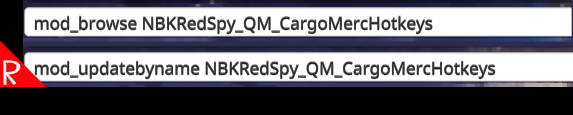

# Quasimorph Update Workshop By Name and Browse Commands



Adds the following commands:

`mod_updateworkshopitem`: Updates a mod by name instead of by id and path.
`mod_browse`: Opens a browser to a mod by name.


Usage:

```
mod_updatebyname foo_mod
mod_browse foo_mod
```

Behind the scenes, the `mod_updateworkshopitem` command invokes the game's `mod_updateworkshopitem` command, passing in the parameters for the selected mod.
Always updates the thumbnail.

# Auto Complete
List all mods by unique name by entering the command name and tab.

Can auto complete a mod name by entering the command, space, part of a mod's name, then tab.

For example: `mod_updatebyname bi` and tab could auto complete to `mod_updatebyname foo_biz`.  

# Support
If you enjoy my mods and want to buy me a coffee, check out my [Ko-Fi](https://ko-fi.com/nbkredspy71915) page.
Thanks!

# Source Code
Source code is available on GitHub at https://github.com/NBK_RedSpy/QM_UpdateWorkshopByName
